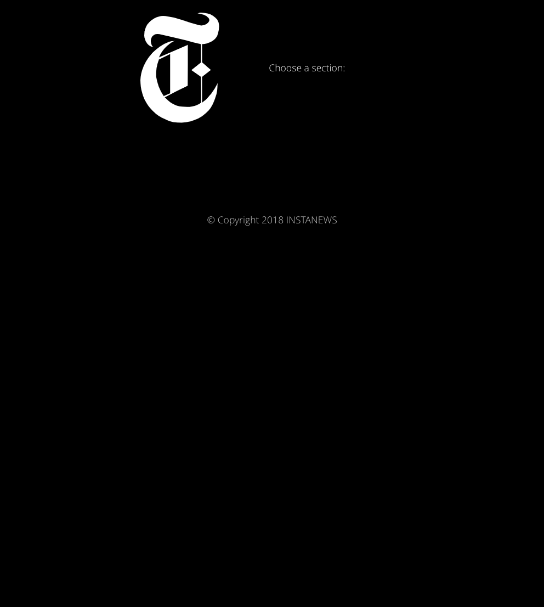
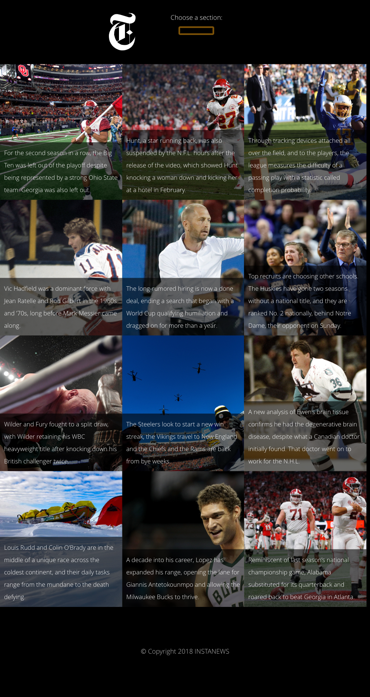

# Project: Instanews
## About this project
You can see this project on-line, going to [Instanews App](https://paulpetillot.github.io/InstaNews/)

----
## Goals of the site
This site has been created to learn how to create a one-page, responsive website that allows a user to filter top news story categories via the New York Times API. 
 HTML5, CSS3, JQUERY and GIT. 

----
## Technology used
HTML5 | CSS3 | Gulp | Sass (CSS Preprocessors) | JQuery | AJAX | API's | CSS animation | Jquey animation | Mobile First | Git | Github | FontFace | 

----
## Personal Learnings

1. JQuery
2. JS 
3. Ajax, JSON and APIs
4. Gulp 
5. Sass syntax
6. Animation with Jquery and CSS/Sass

----
## Link to the files on Github
* **[Instanews on Github](https://paulpetillot.github.io/InstaNews/)**

----
## Media Query Mobile First Break Points 

* 425px

* 600px

* 1200px

----
## Device Screenshots

**Desktop Device**
----

**Tablet Device**
----

**Mobile Device**
----

----
## Dead Line for the project
* 25-Oct-2018

----
## Project developed by 
 **[Paul Petillot]
(https://github.com/PaulPetillot)**

